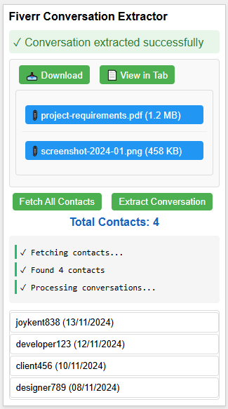

# Fiverr Conversation Extractor

A Chrome extension that helps you extract and save conversations from your Fiverr inbox.

## Features

- Extract conversations from Fiverr inbox
- Download conversations in Markdown format
- View conversations in a new tab
- Download attachments
- Track conversation history
- Support for message replies
- Batch contact fetching

## Installation

1. Clone this repository or download the ZIP file
2. Open Chrome and go to `chrome://extensions/`
3. Enable "Developer mode" in the top right
4. Click "Load unpacked" and select the extension directory

## Usage

1. Open your Fiverr inbox
2. Click the extension icon
3. Either:
   - Click "Fetch All Contacts" to see all your conversations
   - Click "Extract Conversation" when viewing a specific conversation
4. Use the download button (📥) to save the conversation
5. Use the view button (📄) to open the conversation in a new tab
6. Click attachment buttons to download specific files

## Preview

Here's how the extension looks:



Example contact format:
```
joykent838 (13/11/2024)
```

For the complete extension UI mockup, see [Extension UI Design](docs/final-popup-mockup.html)

## Permissions

- `activeTab`: To interact with Fiverr tabs
- `storage`: To store conversation data
- `scripting`: To inject content scripts
- `downloads`: To save conversations and attachments
- `tabs`: To open conversations in new tabs

## Development

The extension uses:
- Manifest V3
- Chrome Extension APIs
- Modern JavaScript (ES6+)
- Markdown for conversation export

## License

MIT License
